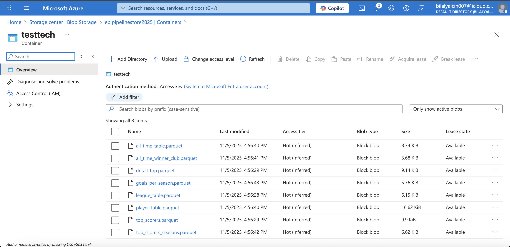
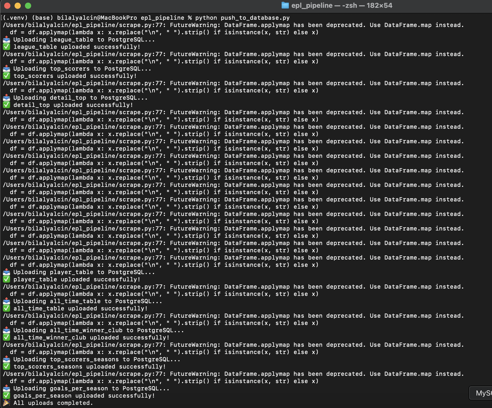
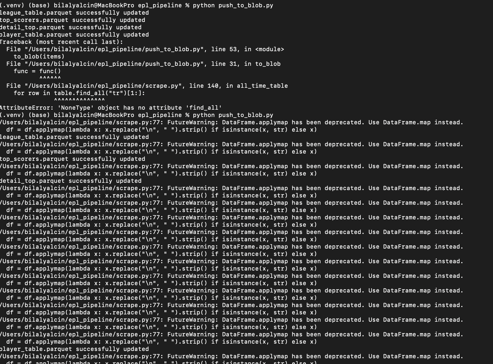
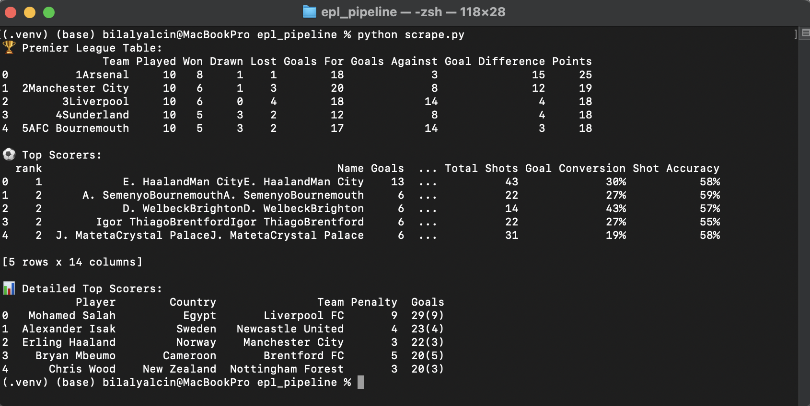

# ⚽ Premier League Data Engineering Pipeline (Python + Azure + Power BI)

This end-to-end ETL project extracts, transforms, and loads Premier League football data using **Python**, **Azure Blob Storage**, **Azure PostgreSQL**, and **Power BI**, fully automated through **GitHub Actions**.

---

## 🧱 Overview
The pipeline scrapes live Premier League data from BBC and WorldFootball, processes it with Pandas, saves Parquet files in Azure Blob Storage, loads them into Azure PostgreSQL, and connects to Power BI for insights.

**Architecture:**
```
BeautifulSoup → Pandas → PyArrow → Azure Blob → Azure PostgreSQL → Power BI
```

---

## ⚙️ Key Components

| File | Description |
|------|--------------|
| `scrape.py` | Web scraping and transformation |
| `push_to_blob.py` | Uploads data to Azure Blob Storage |
| `push_to_database.py` | Loads cleaned data into Azure PostgreSQL |
| `.github/workflows/main.yml` | GitHub Actions for automation |

---

## 🧠 Tools Used
- Python (BeautifulSoup, Pandas, PyArrow, SQLAlchemy)
- Azure Blob Storage & PostgreSQL
- GitHub Actions (CI/CD automation)

---

## 📊 Results
✅ Data transformed and successfully uploaded to Azure Blob and PostgreSQL  
✅ Weekly automated runs via GitHub Actions  

**Sample Screenshots:**






---

## 🧾 Requirements
```
pip install pandas numpy beautifulsoup4 requests python-dotenv azure-storage-blob sqlalchemy pyarrow psycopg2-binary
```

---

## 🔗 Connect with Me
- [LinkedIn](https://www.linkedin.com/in/bilalyalcin007)
- [GitHub](https://github.com/bilalyalcin007)
